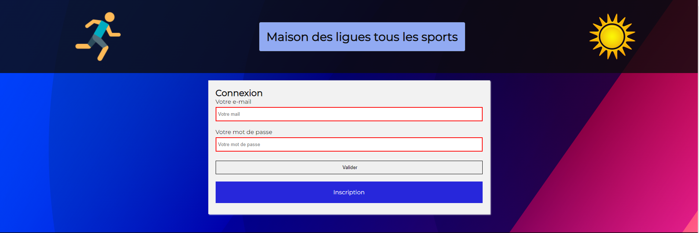

# AP WEB

## Introduction

Cette situation professionnelle est réalisée dans le contexte de la M2L ou Maison des ligues de Lorraine. Une agence nous confie la réalisation d’une page publicitaire pour la Maison de ligues sur le web. La promotion a pour but de conquérir des nouveaux abonné(e)s, en proposant la diffusion de toutes les compétitions sportives.

## Fonctionnement

Le site web présenté ici a pour fonctionnalité globale la possibilité de s’inscrire et de se connecter en créant une session et stocker les informations du client sur la base de données. Il est aussi possible, une fois connecté, de s’inscrire à un des événements de sport présenté sur la page, cette inscription sera enregistrée et invisible par le client, l’information sera également stockée sur la base de données. Cette interface sera décrite ici sous forme de manuel d'utilisation de la page.

### Page accueil

### Page avec formulaire inscription

### Page inscription

### Page connexion

### Page d'inscription à un évenement

### Modèle relationnel de données

#### Ancienne version sans PHP
[Voir ancienne page](https://tinou95.github.io/PPE_streaming/PPE_sans_php/page1.html) &gt;